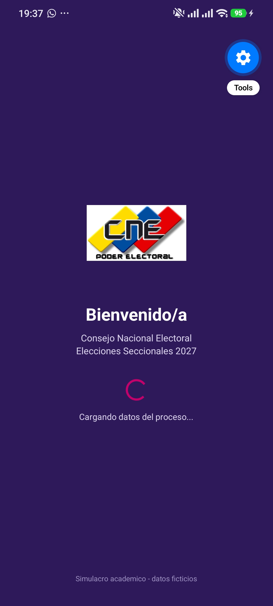
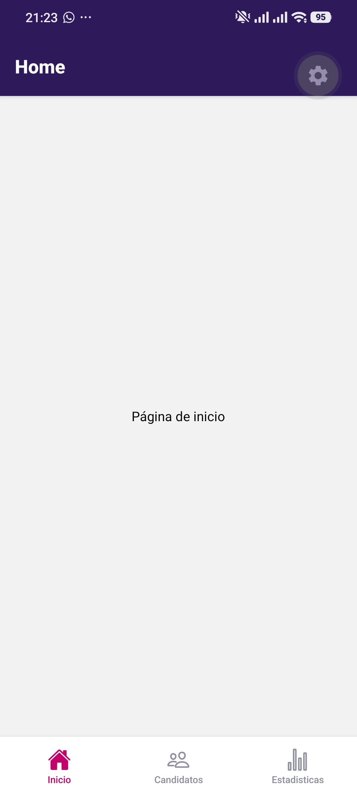
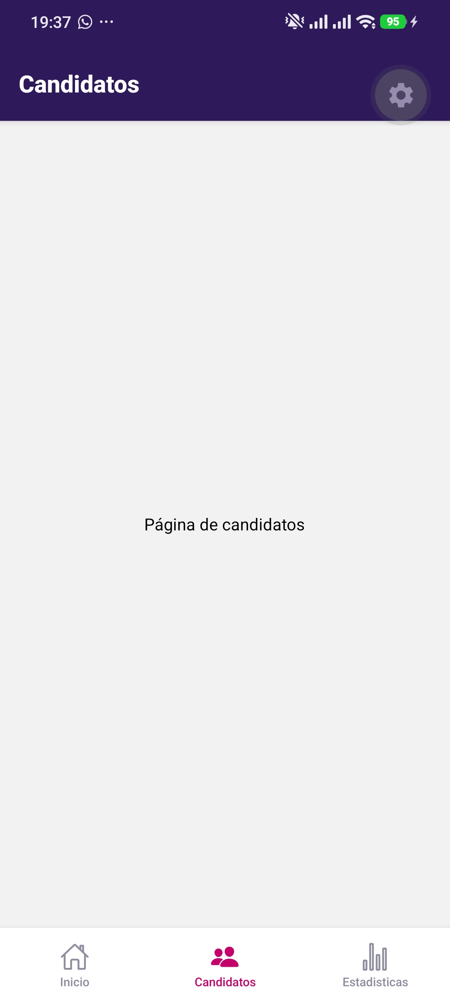
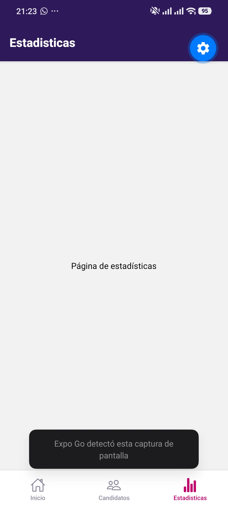
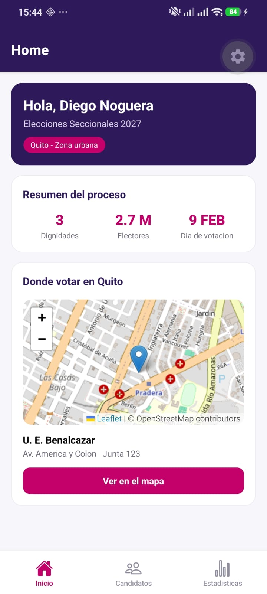

# CNE Quito — Elecciones Seccionales 2027

Aplicación móvil académica desarrollada con React Native y Expo para presentar información ficticia sobre un proceso electoral en Quito. Incluye navegación por pestañas, consulta remota de candidatos, funcionamiento sin conexión mediante SQLite, estadísticas electorales y un CRUD de recordatorios.

> [!IMPORTANT]
> Todos los nombres, movimientos, propuestas, porcentajes y resultados mostrados son ficticios y se utilizan exclusivamente con fines académicos. La aplicación no representa información oficial del Consejo Nacional Electoral y no debe publicarse en tiendas ni difundirse como una fuente electoral real.

## Información académica

- **Asignatura:** Dispositivos Móviles
- **Institución:** Universidad Central del Ecuador
- **Docente:** Ing. Diego Noguera
- **Proyecto base:** Diego Alejandro Chicaiza Quimi
- **Implementación del Tema 8:** Gabriel Mendoza
- **Periodo:** Quito, agosto de 2026

## Funcionalidades

- Pantalla de bienvenida con logotipo, indicador de carga y redirección automática.
- Navegación inferior con las pantallas Inicio, Candidatos, Estadísticas y Recordatorios.
- Consulta de candidatos desde una fuente JSON remota.
- Validación de la respuesta, tiempo límite de 10 segundos y opción para reintentar.
- Respaldo local de candidatos en SQLite para permitir la consulta sin conexión en Android/iOS.
- Gráfico de intención de voto, porcentaje de actas procesadas y cálculo automático del candidato líder.
- CRUD completo de recordatorios: crear, consultar, editar y eliminar.
- Migraciones básicas de SQLite mediante `PRAGMA user_version`.
- Implementaciones específicas para web que evitan cargar SQLite nativo.

## Tecnologías

| Tecnología | Uso |
| --- | --- |
| Expo SDK 57 | Entorno de desarrollo y ejecución |
| React Native 0.86 | Interfaz móvil multiplataforma |
| React 19 | Componentes y gestión de estado |
| TypeScript | Tipado estático |
| Expo Router | Navegación basada en archivos |
| Expo SQLite | Persistencia local en Android/iOS |
| React Native Gifted Charts | Gráfico de barras |
| Ionicons | Iconografía de las pestañas |

## Requisitos previos

- Node.js LTS y npm.
- Expo Go instalado en el teléfono para las pruebas móviles.
- Teléfono y computadora conectados a la misma red; como alternativa, puede utilizarse el modo túnel.

## Instalación y ejecución

```bash
git clone https://github.com/dieguin232323/cne-quito.git
cd cne-quito
npm install
npx expo start
```

Escanea el código QR con Expo Go. Si el teléfono y la computadora están en redes distintas, ejecuta:

```bash
npx expo start --tunnel
```

Para limpiar la caché del proyecto:

```bash
npx expo start -c
```

## Variables de entorno

La aplicación utiliza por defecto el archivo remoto `api/candidatos.json` de este repositorio. La URL puede reemplazarse creando un archivo `.env` en la raíz:

```env
EXPO_PUBLIC_CANDIDATOS_API_URL=https://ejemplo.com/candidatos.json
```

La respuesta debe ser un arreglo JSON con la estructura definida en `data/candidatos.ts`.

## Funcionamiento de la persistencia

En Android/iOS, el repositorio de candidatos intenta consultar primero la fuente remota. Cuando la respuesta es válida, actualiza la tabla local `candidatos`; si la API no está disponible, recupera el último respaldo guardado en SQLite.

La base `cne.db` contiene:

| Versión | Migración |
| --- | --- |
| 1 | Creación de la tabla `candidatos` |
| 2 | Creación de la tabla `recordatorios` |

En web, los candidatos se consultan directamente desde la API y los recordatorios se mantienen temporalmente en memoria durante la sesión.

## Estructura principal

```text
cne-quito/
├── api/
│   └── candidatos.json              Fuente JSON remota
├── app/
│   ├── _layout.tsx                  Navegación raíz
│   ├── index.tsx                    Pantalla de bienvenida
│   └── (tags)/
│       ├── _layout.tsx              Navegación por pestañas
│       ├── home.tsx                 Pantalla de inicio
│       ├── candidatos.tsx           Consulta de candidatos
│       ├── estadisticas.tsx         Gráfico y resultados
│       └── recordatorios.tsx        Interfaz del CRUD
├── components/                      Componentes reutilizables
├── data/                            Tipos y datos electorales ficticios
├── services/
│   ├── baseDatos.ts                 Apertura y migraciones de SQLite
│   ├── candidatosApi.ts             Consulta y validación de la API
│   ├── candidatosDb.ts              Respaldo local de candidatos
│   ├── candidatosRepository.ts      Estrategia API → SQLite
│   ├── recordatoriosDb.ts           CRUD nativo con SQLite
│   └── *.web.ts                     Implementaciones para web
└── theme/                            Paleta de colores
```

## Cumplimiento del proyecto

| Criterio | Evidencia principal | Estado |
| --- | --- | :---: |
| Splash con logotipo, carga y redirección automática | `app/index.tsx`, `app/_layout.tsx`, `app.json` | ✅ Completado |
| Navegación inferior entre pantallas | `app/(tags)/_layout.tsx` | ✅ Completado |
| Home con bienvenida, resumen y lugar de votación | `app/(tags)/home.tsx`, `components/Bienvenida.tsx`, `components/ResumenProceso.tsx`, `components/DondeVotar.tsx` | ✅ Completado |
| Listado de al menos tres candidatos con imagen y propuesta | `app/(tags)/candidatos.tsx`, `components/CandidatoCard.tsx` | ✅ Completado |
| Gráfico de intención de voto y cálculo del líder | `app/(tags)/estadisticas.tsx`, `components/BarraProgreso.tsx`, `data/intencion.ts` | ✅ Completado |
| Consumo de API con carga, error y reintento | `services/candidatosApi.ts`, `services/candidatosRepository.ts`, `app/(tags)/candidatos.tsx` | ✅ Completado |
| Respaldo local de candidatos para uso sin conexión | `services/candidatosDb.ts`, `services/candidatosRepository.ts` | ✅ Completado |
| CRUD de recordatorios con persistencia local | `app/(tags)/recordatorios.tsx`, `services/recordatoriosDb.ts` | ✅ Completado |
| Migraciones básicas con `PRAGMA user_version` | `services/baseDatos.ts` | ✅ Completado |
| Componentes reutilizables y organización por capas | `components/`, `data/`, `services/`, `theme/` | ✅ Completado |
| Repositorio, historial de commits y README actualizado | Git y `README.md` | ✅ Completado |
| PDF de evidencias y envío del enlace del repositorio | Entregable externo | ⏳ Pendiente |
| Defensa y demostración en Expo Go | Entregable externo | ⏳ Pendiente |

## Validaciones

Antes de enviar cambios o crear un *pull request*, ejecutar:

```bash
npx tsc --noEmit
git diff --check
```

Pruebas funcionales realizadas en Android:

- Consulta de candidatos con conexión y recuperación desde SQLite sin conexión.
- Creación, persistencia, edición y eliminación de recordatorios.
- Conservación de datos después de aplicar las migraciones.
- Navegación correcta entre todas las pestañas.

## Capturas de pantalla

| Splash | Inicio |
| :---: | :---: |
|  |  |

| Candidatos | Estadísticas |
| :---: | :---: |
|  |  |

| Home | Candidatos |
| :---: | :---: |
|  |  |

## Licencia

Este repositorio se distribuye bajo los términos incluidos en [LICENSE](LICENSE).
